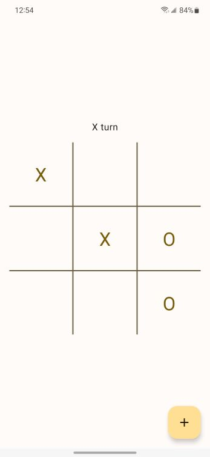
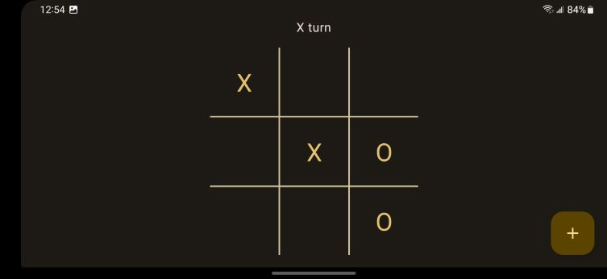

## Tic Tac Toe Android
Tic Tac Toe is played on a 3x3 grid with two players **Xs** and **Os**. The player who succeeds in placing three of their marks in a horizontal, vertical, or diagonal row is the winner.
 
**Tic Tac Toe Android** uses modern Material UI 3 design to bring an engaging and exciting twist to the classic Tic Tac Toe game. Tic Tac Toe Android can be customized based on the system colors and adapts to different themes.

## Download the App
Coming soon 🚧

## Screenshots
### Light theme

### Dark theme

## Getting Started
These instructions give the most direct path to a working Tic Tac Toe Android development environment.

### 1. System Requirements
[Android Studio 2022.1.1](https://developer.android.com/studio) or newer needs to be installed

### 2. Getting Sources for Tic Tac Toe
**Via HTTPS**  For those checking out sources HTTPS works best:

    git clone https://github.com/Vithop/TicTacToe

### 3. Open project
Open **android** folder in Android Studio. Click *Run app* to build and deploy the application.
